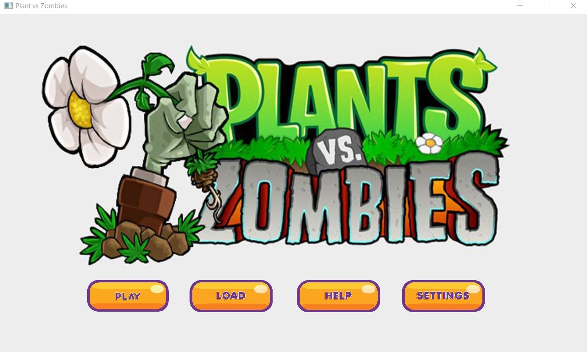
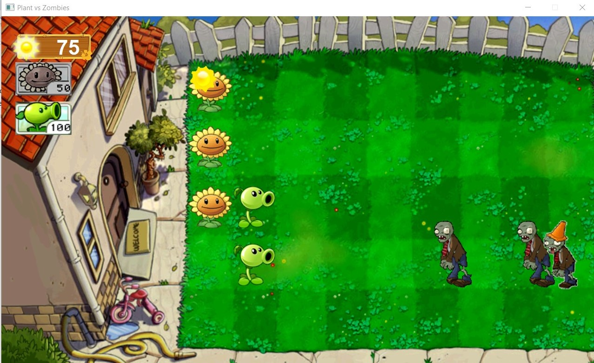

# PvsZ - Plants vs. Zombies

This is my final project for *Object-Oriented Programming* where I can study OOP technique in Java

PvsZ project was inspired by a classic game named *Plants Vs. Zombie* developed by *PopCap Games*. This is a defense game with a zombie apocalypse theme. You are in a role of the house owner, your task is to soil the plants to defend the zombie that about to invade your house.

## Screenshots

Game Menu

Game Play

To run this project  
Run the file Main.java in *src* folder - I used IntelliJ IDEA for this project.